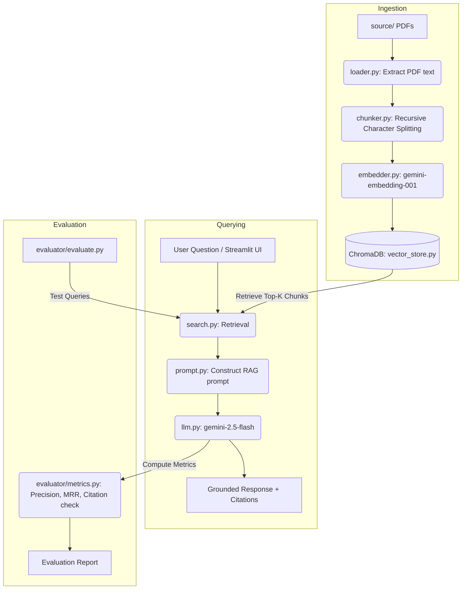
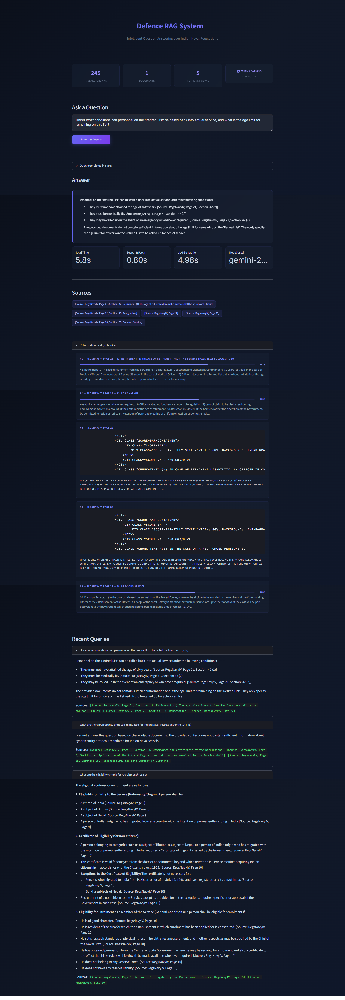

frontend ui depoly link ; https://vanillaragsystemgit-e3uemcg3qdiqt7drerkqho.streamlit.app/

# 🛡️ Defence RAG System

An intelligent, Retrieval-Augmented Generation (RAG) system built to parse, search, and reason over Indian Naval Regulations and Defence Procurement Policies. 

This project provides a robust backend pipeline and a beautifully designed, transparent Streamlit frontend to interactively query complex regulatory documents with perfect citations.

## ✨ Why We Built This
Navigating massive regulatory documents like the `RegsNavyIV.pdf` is time-consuming and error-prone. This project was developed to:
1. **Automate Document Retrieval:** Quickly find the exact page and section for any query.
2. **Synthesize Complex Rules:** Use advanced LLMs to answer complex questions without hallucinating.
3. **Ensure Transparency:** Provide a UI that explicitly shows *what* the system is doing, *how long* it takes, and *which exact texts* it's relying on.

## 🏗️ Architecture & Design Plan

The system follows a modular, best-practice RAG (Retrieval-Augmented Generation) pipeline:

### 1. System Pipeline Flow
```
========================================================================================
                                   INGESTION STAGE
========================================================================================
   [source/*.pdf] ──> [loader.py] ──> [chunker.py] ──> [embedder.py] ──> [vector_store.py]
   (PDF Documents)   (Extract PDF)   (Token Chunk)   (Create Vector)    (Save to ChromaDB)

========================================================================================
                                RETRIEVAL & GENERATION
========================================================================================
   [User Query] ──────> [search.py] ──────> [vector_store.py]
                            │                     │
                            ▼                     ▼
                     (Retrieve Top-K Chunks) ──> (Pass Relevant Context)
                                                      │
                                                      ▼
   [Refined Answer] <── [llm.py] <── [prompt.py] ◄────┘
   (With Citations)   (Gemini 2.5)  (System Prompt)
```

### 2. Detailed Component Diagram


### 3. Pipeline Component Descriptions
- **Ingestion (`ingest/`)**: Uses `pdfplumber` to extract text from PDFs, and `RecursiveCharacterTextSplitter` to cleanly chunk the text (1000 chars, 200 overlap).
- **Embeddings & Vector Store (`retriever/`)**: Uses Google's `gemini-embedding-001` with exponential backoff for rate limits, storing vectors persistently in `ChromaDB`.
- **Generation (`generator/`)**: Prompts the LLM (`gemini-2.5-flash`) to strictly rely on retrieved context and generate citations.
- **Evaluation (`evaluator/`)**: Computes Retrieval Precision, MRR, Citation Validity, and Hallucination rates.

---

## 📂 Project Directory Structure

Here is an overview of the directory structure of the repository:

```
jaggaer/
├── .env                  # Local secret keys (ignored by git)
├── .env.example          # Template for environment configuration
├── .gitignore            # Git exclusion rules
├── README.md             # Project documentation (this file)
├── requirements.txt      # Python dependencies
├── app.py                # Streamlit Frontend Web Interface
├── config.py             # System configurations and model definitions
├── main.py               # CLI Entrypoint (Ingest, Query, Evaluate)
├── extract_pdf.py        # Diagnostic utility to inspect PDF texts
├── source/               # Document directory for policy PDFs
│   └── RegsNavyIV.pdf    # Target PDF document on Navy regulations
├── ingest/               # Document ingestion pipeline
│   ├── __init__.py
│   ├── loader.py         # PDF page extraction using pdfplumber
│   ├── chunker.py        # Semantic/token chunking logic
│   └── embedder.py       # Vector embedding creation (Gemini API)
├── retriever/            # Context retrieval system
│   ├── __init__.py
│   ├── search.py         # Cosine similarity and Chroma query interface
│   └── vector_store.py   # ChromaDB database operations
├── generator/            # Response generation module
│   ├── __init__.py
│   ├── llm.py            # LLM wrapper & rate-limit handling (Gemini 2.5)
│   └── prompt.py         # Grounding & citation system prompt
└── evaluator/            # Evaluation & metrics engine
    ├── __init__.py
    ├── evaluate.py       # Test query execution engine
    └── metrics.py        # Precision, MRR, & citation validation logic
```

---

## 🚀 How to Run Locally

### 1. Prerequisites
- Python 3.10+
- A Google Gemini API Key

### 2. Installation
Clone the repository and install the dependencies:
```bash
# Install dependencies
pip install -r requirements.txt
```

### 3. Configuration
Rename `.env.example` to `.env` (or create a new `.env` file) and add your API key:
```env
EMBEDDING_PROVIDER=gemini
LLM_PROVIDER=gemini
GEMINI_API_KEY=your_actual_api_key_here
```

### 4. Run the Application
The project includes a beautiful Streamlit UI. Start it using:
```bash
python -m streamlit run app.py
```
*Open your browser and navigate to `http://localhost:8501`.*

### 5. Using the CLI (Backend Only)
You can also run the system entirely from the command line:
```bash
# Ingest new documents from the /source folder
python main.py ingest --data-dir ./source --reset

# Ask a direct question
python main.py query "What are the eligibility criteria for recruitment?" --verbose

# Run the automated evaluation suite
python main.py evaluate --samples
```

---

## 📸 Output — Working Locally

Below are screenshots of the system running locally on `http://localhost:8501`, demonstrating end-to-end query answering with full transparency.

### Query 1: *"What are the eligibility criteria for recruitment?"*


- **Total Time:** 11.5s (Search: 2.48s, LLM Generation: 8.99s)
- **Model Used:** `gemini-2.5-flash`
- The system retrieves **5 relevant chunks** from `RegsNavyIV.pdf` and generates a structured answer covering:
  - Eligibility for Entry by Nationality/Origin (citizens of India, Bhutan, Nepal, etc.)
  - Certificate of Eligibility requirements for non-citizens
  - Eligibility for Enrolment as a Member of the Service (General Conditions)
- All claims are **grounded with page-level citations** (e.g., *Source: RegsNavyIV, Page 9, Page 10, Page 14*).

### Query 2: *"Under what conditions can personnel on the 'Retired List' be called back into actual service, and what is the age limit for remaining on this list?"*



- **Total Time:** 5.8s (Search: 0.80s, LLM Generation: 4.98s)
- **Model Used:** `gemini-2.5-flash`
- This is a **hard, multi-hop question** requiring cross-referencing across multiple regulation sections.
- The system correctly identifies the 3 conditions for recall:
  1. Must not have attained the age of sixty years
  2. Must be medically fit
  3. May be called up in the event of an emergency or whenever required
- The system also **honestly states** when it cannot find sufficient information for part of the question (age limit for remaining on the list vs. being called up), demonstrating its **anti-hallucination grounding**.
- Also shows the system correctly **refusing to answer an out-of-scope question** about cybersecurity protocols.

---

## 📊 Features
- **Dynamic UI:** Glassmorphism design, real-time step trackers, and detailed timing metrics.
- **Rate Limit Handlers:** Automatic exponential backoff and batching (20 chunks/batch) to seamlessly work on the Gemini free tier.
- **Strict Grounding:** The model is explicitly trained to refuse unanswerable questions to prevent hallucinations.

---

## 📁 Dataset

**Source:** [DefenceRAG: Procurement & Policy Reasoning Challenge — Kaggle](https://www.kaggle.com/competitions/defence-rag-procurement-policy-reasoning-challenge/data)

This project uses the dataset from the Kaggle competition **"DefenceRAG: Procurement & Policy Reasoning Challenge"**. Key details:

- **Objective:** Build RAG systems to interpret defence procurement rules, financial delegations, and naval regulations with explainable answers.
- **Core Document:** `RegsNavyIV.pdf` — *The Indian Naval Auxiliary Service Regulations, 1973* (Amendments to the Regulations for the Navy, 1965).
- **Document Coverage:**
  - Chapter I — Preliminary (Definitions, Short Title, Commencement)
  - Chapter II — Officers (Branches, Commissions, Examinations, Probation, Promotion, Secondment, Retirement)
  - Chapter III — Sailors (Recruitment, Promotion, Transfer, Discharges, Retirements)
  - Chapter IV — Appointment and Duties (Permanent Staff, Duties of Officers)
  - Chapters V–XI — Training, Uniforms, Discipline, Pay & Allowances, Accommodation, Leave, Pensions & Gratuities
  - Schedules I–XI — Forms, Terms of Service, Uniform Items, Tentage Scales
- **Total Pages:** 99 pages of statutory naval regulations
- **Challenge Type:** Question-answering with citation and grounding requirements
- **Evaluation Criteria:** Retrieval Precision, MRR (Mean Reciprocal Rank), Citation Validity, and Hallucination Detection
